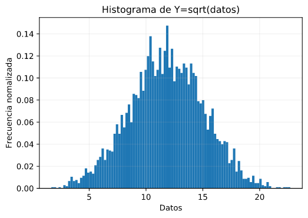

# Tarea 3 
## Kaseng Fong 
## B42609


# Parte 1. Mejor curva de ajuste para las funciones de densidades marginales X y Y.


# Parte 2 

``` python
xy = pd.read_csv("xy.csv",header = 0,index_col=0)

x = np.linspace(5,15,11)
y = np.linspace(5,25,21)

fy= np.sum(xy,axis=0)
fx= np.sum(xy,axis=1)

#Curva de mejor ajuste. 
def gaussiana(x,mu,sigma):
    return 1/(np.sqrt(2*np.pi*sigma**2))*np.exp(-(x-mu)**2/(2*sigma**2))

param_x,_=curve_fit(gaussiana,x,fx)
param_y,_=curve_fit(gaussiana,y,fy)

print(param_x)
print(param_y)
```


# Parte 3


# Parte 4


